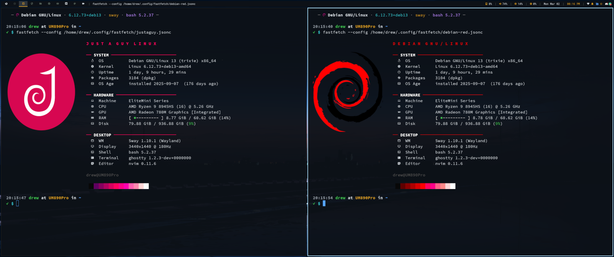

# Fastfetch Configs

A small collection of fastfetch configurations and an installer script for Debian-based systems.



---

## What's Included

- **install_fastfetch.sh** — installs the latest fastfetch `.deb` and deploys configs to `~/.config/fastfetch/`, with automatic shell alias setup for bash, zsh, and fish
- **config.jsonc** — default configuration
- **minimal.jsonc** — minimal output
- **fancy.jsonc** — more detailed, styled output
- **neon.jsonc** — neon color scheme
- **debian-red.jsonc** — Debian red theme
- **justaguy.jsonc** — JustAGuyLinux personal config
- **server.jsonc** — server-focused output

## Requirements

- Debian-based Linux
- `wget`
- `sudo` privileges

## Installation

```bash
git clone https://justaguy.dev/drew/butterscripts.git
cd butterscripts/fastfetch
chmod +x install_fastfetch.sh
./install_fastfetch.sh
```

The installer will:
1. Check if fastfetch is already installed
2. Download and install the latest `.deb` package if needed
3. Copy config files to `~/.config/fastfetch/`
4. Add a `ff` alias to your shell config (bash, zsh, or fish)

## Usage

```bash
# Default config (via alias)
ff

# Specific configs
fastfetch -c ~/.config/fastfetch/minimal.jsonc
fastfetch -c ~/.config/fastfetch/server.jsonc
fastfetch -c ~/.config/fastfetch/neon.jsonc
```

---

## License

GPL-2.0 - See [LICENSE](../LICENSE) for details.

## Support

<a href="https://www.buymeacoffee.com/justaguylinux" target="_blank"></a>

## Connect

- [YouTube](https://youtube.com/@justaguylinux)
- [Butterforge](https://justaguy.dev/drew)
- [Discourse](https://lab.justaguylinux.com)
- [Fluxer](https://fluxer.gg/JfcV95PK)
- [Wiki](https://justaguy.wiki)
- [Mastodon](https://fosstodon.org/@justaguylinux)

---

Made with butter by JustAGuyLinux
