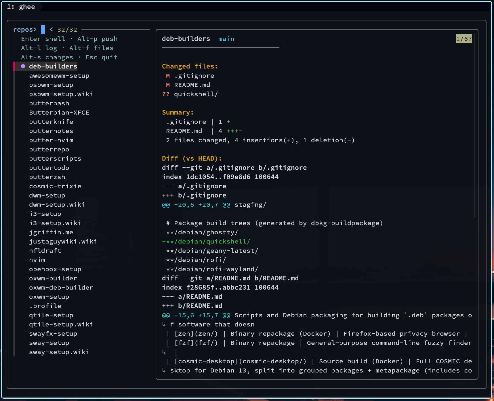
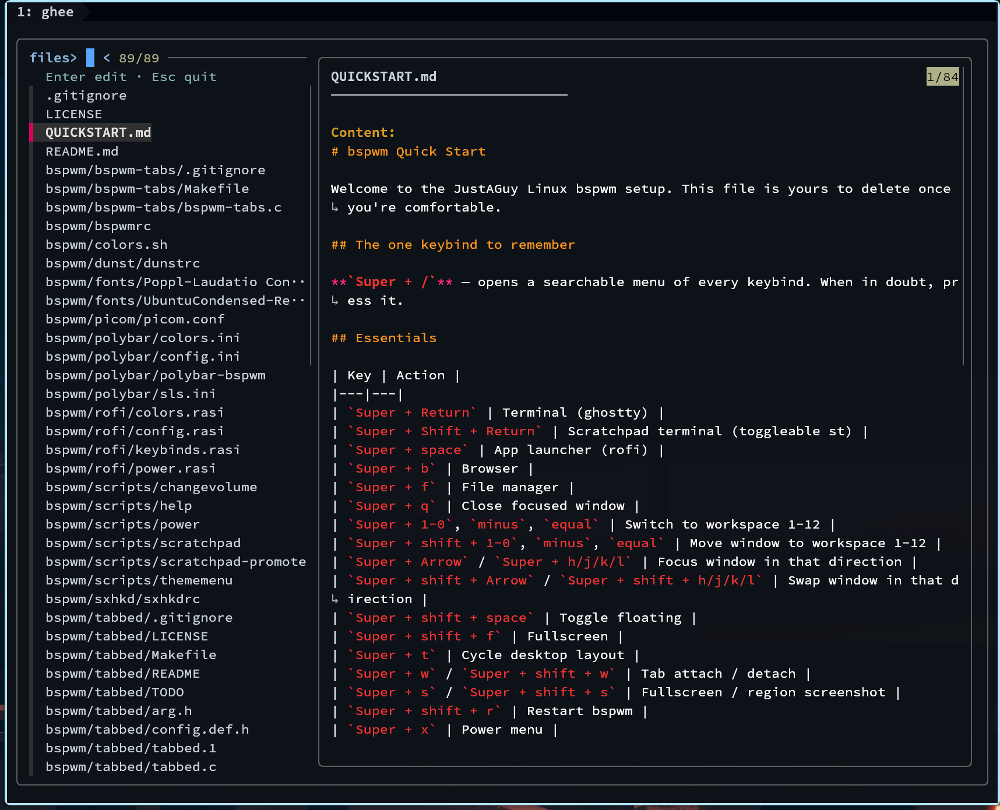

# Git Scripts

Git workflow utilities — `ghee`, the fzf suite, commit flow, and multi-repo
tools in one program.

## Requirements

[`fzf`](https://github.com/junegunn/fzf) (0.60+, Debian 13), git,
openssh-client for `ghee ssh`. Optional: `bat` for syntax-highlighted
file previews (plain text without it).

## Installation

```bash
git clone https://justaguy.dev/drew/butterscripts.git
cd butterscripts/git
install -m755 ghee ~/.local/bin
```

## ghee

The fzf suite clarified into one program — repo hub, working-tree cockpit,
commit/file pickers, and ssh picker, sharing one core.

```bash
ghee            # dirty repo: changes; otherwise: repo hub
ghee repos ~/src
ghee changes    # stage/unstage/discard cockpit
ghee log -n 50  # pick a commit; prints the hash
ghee files src/ # pick a tracked file; edit it (prints when piped)
ghee ssh        # pick a host; connect
ghee commit     # review, discard strays, commit & push
ghee status     # read-only dashboard of every repo
ghee sweep      # run the commit flow in every dirty repo
ghee today      # today's commit counts across repos
```

`repos`, `status`, `sweep`, and `today` take a base directory: an argument,
else `$GHEE_BASE`, else `~/ButterForge`, else the current directory. Repos are
found up to `$GHEE_DEPTH` levels down (default 2 — a flat layout plus the
base itself; nested layouts like `~/src/host/user/repo` want `GHEE_DEPTH=4`).

In any picker, `Ctrl-/` cycles the preview pane: 70% → 50% → hidden.

- **repos** — browse repos with status markers. Enter drops into a shell,
  Alt-p runs the commit flow, Alt-l/f/s open log/files/changes in the repo.
- **changes** — live cockpit: `Tab` multi-select, `Ctrl-s` stage, `Ctrl-u`
  unstage, `Ctrl-d` discard (asks first). Header shows live counts; closes
  itself when the tree is clean. Enter prints the path(s).
- **log / files** — pickers with diff and content/history previews. `log`
  prints the hash; `files` opens `$EDITOR`. Both print to stdout when
  piped, so they compose: `git show $(ghee log)`.
- **ssh** — host picker for `~/.ssh/config`; preview shows the resolved
  user/hostname/port/keys (via `ssh -G`, so Match rules are reflected).
  Connects on Enter; with stdout piped it prints the host instead:
  `scp file "$(ghee ssh)":/tmp/`.
- **commit** — the buttergit flow: status + diff overview in box-drawing
  frames, discard strays (by number/name, or `c` for the full cockpit),
  multi-line commit message (blank line finishes), then
  `git add -A && git commit && git push`. Warns when unpushed commits will
  ride along, offers push-only when there's nothing new, handles renames,
  quoted/unicode paths, and missing upstream (`push -u origin <branch>`).
- **status** — read-only dashboard: one line per repo (changes / ↑ahead /
  ↓behind), dirty repos first. No interaction.
- **sweep** — loops every repo under a base dir and runs the commit flow for
  any with uncommitted changes.
- **today** — today's commit counts per repo, with a running total.

It dispatches on its invoked name too, so the classic names keep working:

```bash
for t in repos changes log files ssh; do ln -sf ~/.local/bin/ghee ~/.local/bin/fzf-$t; done
ln -sf ~/.local/bin/ghee ~/.local/bin/buttergit-tui
ln -sf ~/.local/bin/ghee ~/.local/bin/butter-status
```

## Screenshots

The repo hub — status markers, diff preview:



The files picker — bat-highlighted content preview:


